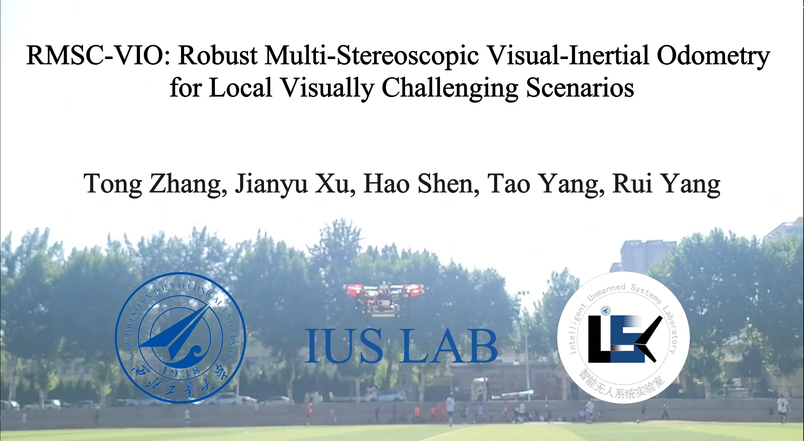
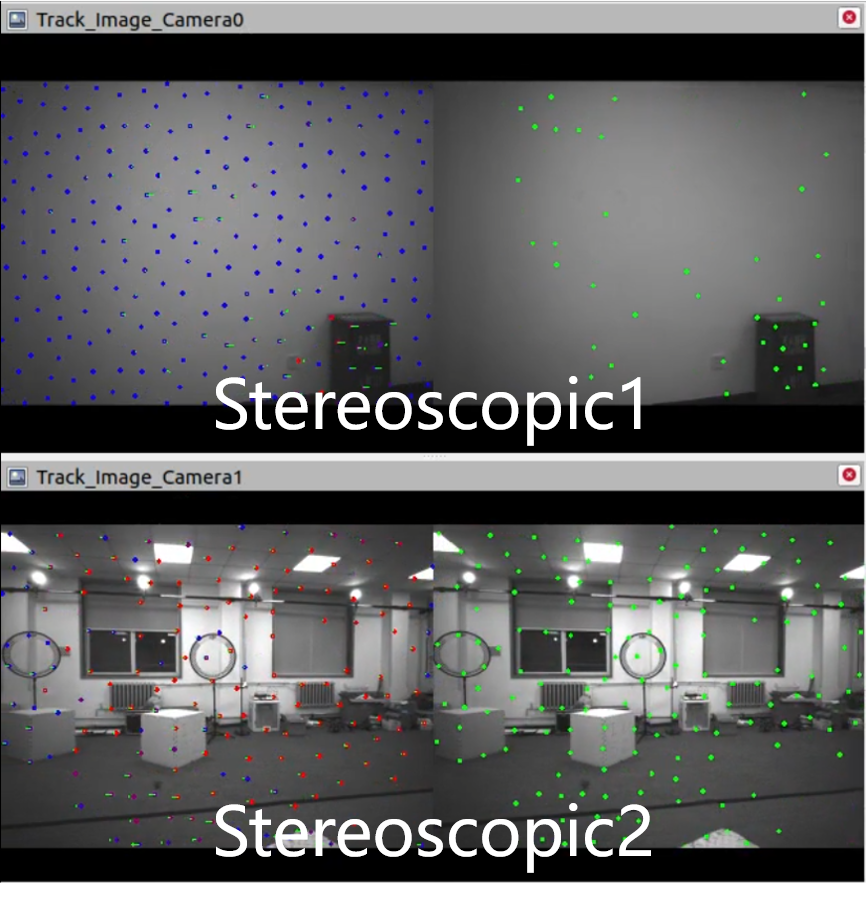
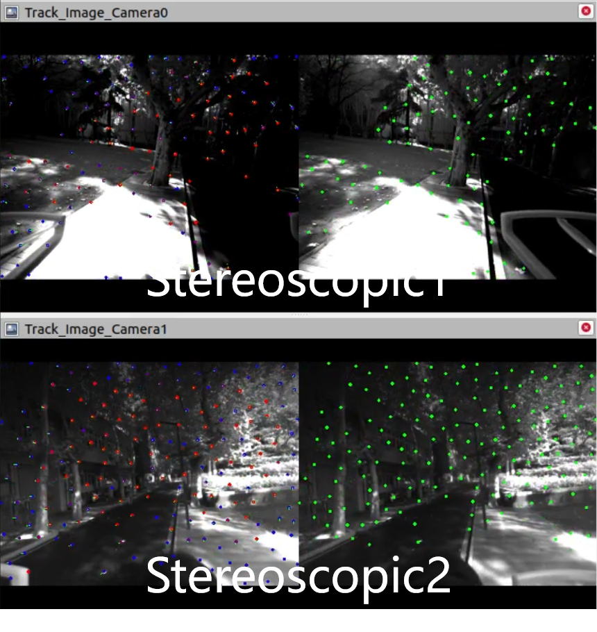
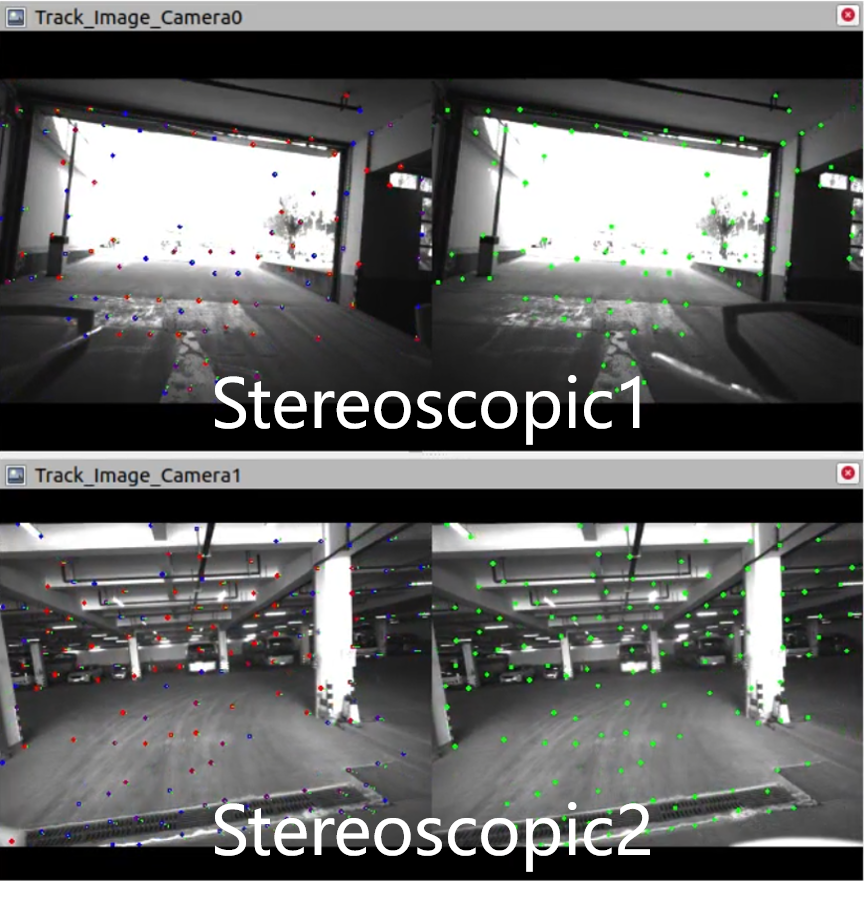
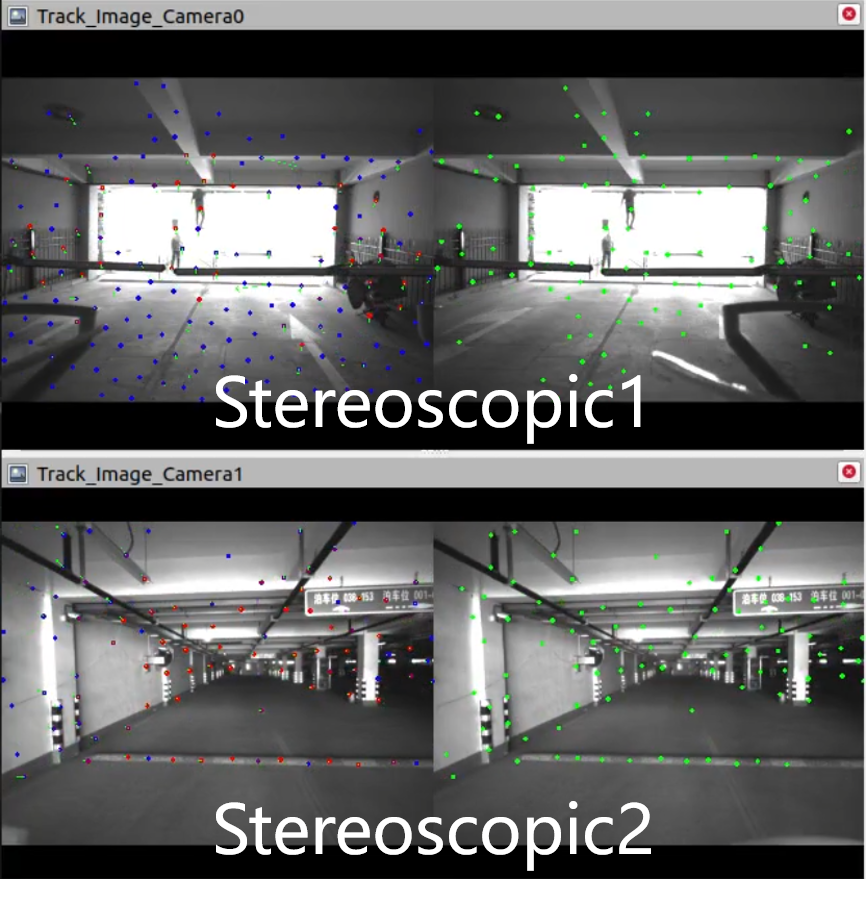

# RMSC-VIO

### RMSC-VIO: Robust Multi-Stereoscopic Visual-Inertial Odometry for Local Visually Challenging Scenarios

We present a Multi-Stereoscopic Visual-Inertial Odometry (VIO) system capable of integrating an arbitrary number of stereo cameras, exhibiting excellent robustness in the face of visually challenging scenarios. During system initialization, we introduce multi-view keyframes for simultaneous processing of multiple image inputs and propose an adaptive feature selection method to alleviate the computational burden of multi-camera systems This method iteratively updates the state information of visual features, filtering out high-quality image feature points and effectively reducing unnecessary redundancy consumption. In the backend phase, we propose an adaptive tightly coupled optimization method, assigning corresponding optimization weights based on the quality of different image feature points, effectively enhancing localization precision. We validate the effectiveness and robustness of our system through a series of datasets, encompassing various visually challenging scenarios and practical flight experiments. Our approach achieves up to a 90\% reduction in Absolute Trajectory Error (ATE) compared to state-of-the-art multi-camera VIO methods.

Click for the video demo.

## 1. Datasets

    

We collected seven sequences, comprising three indoor and four outdoor scenes. These sequences included challenging visual scenarios. such as featureless environments, frequent occlusions, abrupt lighting changes, overexposure, dynamic objects, and large-scale scenes.
For indoor sequences, we utilized a motion capture system to acquire ground truth poses with millimeter-level accuracy. For outdoor sequences, Real-Time Kinematic (RTK) technology was employed to obtain ground truth trajectories with centimeter-level precision.

### 1.1 [Indoor_topic]

    Stereoscopic1: /camera1/infra1/image_rect_raw 15Hz, /camera1/infra2/image_rect_raw 15Hz

    Stereoscopic2: /camera2/infra1/image_rect_raw 15Hz, /camera2/infra2/image_rect_raw 15Hz

    imu: /mavros/imu/data_raw 200Hz

    ground truth: /odometry 100Hz
    
### 1.2 [Outdoor_topic]

    Stereoscopic1: /camera1/infra1/image_rect_raw 15Hz, /camera1/infra2/image_rect_raw 15Hz

    Stereoscopic2: /camera2/infra1/image_rect_raw 15Hz, /camera2/infra2/image_rect_raw 15Hz

    imu: /mavros/imu/data_raw 200Hz

    ground truth: /mavros/global_position/raw/fix 10Hz

[RMSC-VIO Datasets](https://pan.baidu.com/s/1vOmaT4yJX6tf_EHAj20-Dw?pwd=RMSC).

